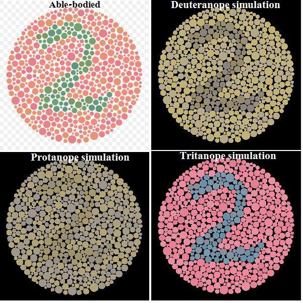
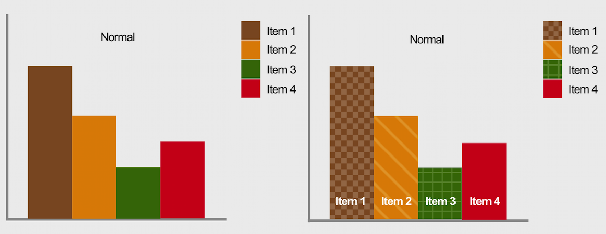
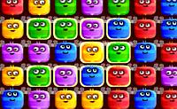

# Empath

## See the web through the eyes of others.

Empathy Browser simulates how people with different disabilities experience the web. It builds empathy and promotes inclusion. This web browser uses various technologies to simulate the mismatch between the diversity of human capabilities and the internet.

Websites and digital materials that are not designed with accessibility in-mind exclude a significant population of potential users. Empathy Browser allows professionals, such as web developers and designers, to experience their projects in ways that relate them to users with a different array of abilities.

By experiencing a simulation of common disabilities, Empathy Browser will help you promote true diversity in a digital world. It will change the way technology professionals think about inclusive design, thus transforming technology and positively impacting the world.

---

Note: The images below are used to diagnose common forms of color blindness. Use the tools in Empathy Browser to view these images as they appear to other people. Can you identify ways in which these images lose their meaning?







See [the website](https://13protons.github.io/empath/) for more info and visual examples.

> Note: this project is in early stages. Drop a line if you'd like to help out!

#### Build Setup

``` bash
# install dependencies
npm install

# serve with hot reload at localhost:9080
npm run dev

# build electron application for production
npm run build

# run unit & end-to-end tests
npm test


# lint all JS/Vue component files in `src/`
npm run lint

```

---

This project was generated with [electron-vue](https://github.com/SimulatedGREG/electron-vue)@[8fae476](https://github.com/SimulatedGREG/electron-vue/tree/8fae4763e9d225d3691b627e83b9e09b56f6c935) using [vue-cli](https://github.com/vuejs/vue-cli). Documentation about the original structure can be found [here](https://simulatedgreg.gitbooks.io/electron-vue/content/index.html).
